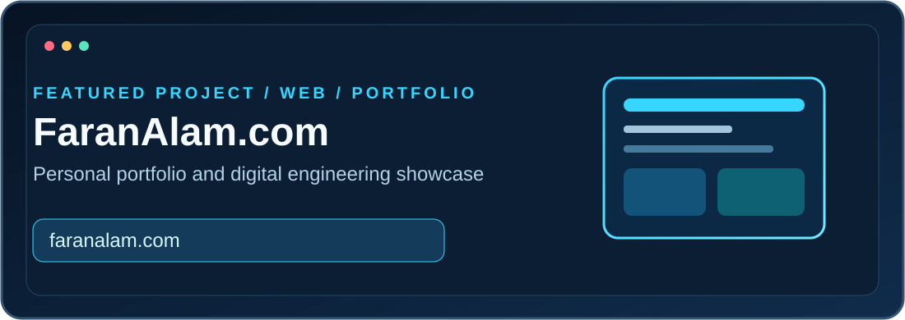
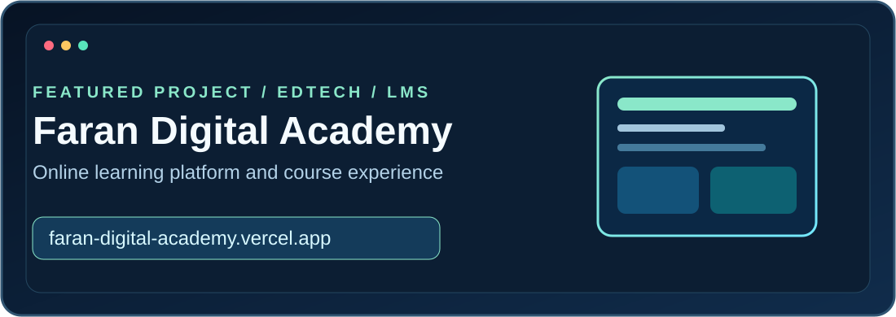
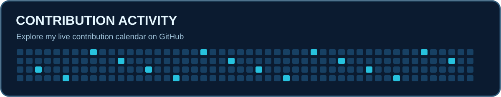

<!-- FARAN ALAM | SELF-HOSTED VISUALS | GITHUB-SAFE MARKDOWN -->

 

**Engineering complete digital products — from interface to infrastructure.**

[Portfolio](https://www.faranalam.com/) &nbsp; • &nbsp; [Digital Academy](https://faran-digital-academy.vercel.app/) &nbsp; • &nbsp; [LinkedIn](https://www.linkedin.com/in/faran-alam-14203abc) &nbsp; • &nbsp; [GitHub](https://github.com/FaranAlam) &nbsp; • &nbsp; [Email](mailto:faranalam14203@gmail.com)

**Computer Engineering · IIUI, Islamabad · Pakistan**  
*Open to freelance projects and technical collaborations*

---

<table><tr><td width="65%" valign="top">
<h3>Engineering software from idea to deployment.</h3>

I'm <strong>Faran Alam</strong>, a Full Stack Software Engineer and Computer Engineering student at International Islamic University Islamabad. I develop web platforms, mobile applications and custom business software, with additional interests in intelligent hardware-connected systems.

<ul>
<li><strong>Web:</strong> Next.js, React, Node.js, Express, MongoDB and PostgreSQL.</li>
<li><strong>Mobile:</strong> Flutter, Dart and API-connected cross-platform apps.</li>
<li><strong>Software:</strong> Authentication, role-based platforms, dashboards, APIs and automation.</li>
<li><strong>Additional:</strong> Computer vision, Edge AI, IoT and embedded systems.</li>
<li><strong>Education:</strong> Web development and project-based learning through Faran Digital Academy.</li>
</ul>

<em>Maintainable engineering. Purposeful interfaces. Real-world solutions.</em>

</td><td width="35%" align="center" valign="middle"></td></tr></table>

| Discipline | Technologies and capabilities |
| :--- | :--- |
| **Frontend & UI** | HTML5, CSS3, JavaScript, TypeScript, React, Next.js, Tailwind CSS, Bootstrap, Figma |
| **Backend & APIs** | Node.js, Express.js, Python, REST APIs, authentication |
| **Databases** | MongoDB, PostgreSQL, MySQL, data modeling |
| **Mobile Engineering** | Flutter, Dart, Android Studio, API integration |
| **Intelligent Systems** | TensorFlow Lite, OpenCV, CNN, Edge AI |
| **Hardware & IoT** | ESP32, Arduino, Raspberry Pi, sensor integration |
| **Tooling & Delivery** | Git, GitHub, VS Code, Cursor, GitHub Copilot, Vercel, Postman, Linux |

| Role | Selected work |
| :--- | :--- |
| **Subcontractor Development Partner · Dream Growth Agency** | Custom websites, e-commerce mobile applications and agency project delivery. |
| **Full Stack Developer · Sarwar English Lab (xSEL)** | Next.js and MongoDB LMS, role-based access and MCQ evaluation. |
| **Founder & Instructor · [Faran Digital Academy](https://faran-digital-academy.vercel.app/)** | Web development education, enrollment workflows and student mentorship. |
| **Volunteer Web Developer · ISCB-SC RSG Pakistan** | Website development and digital workflows. |
| **Freelance Software Engineer** | Websites, software solutions and cross-platform mobile applications. |

**[Visit personal portfolio →](https://www.faranalam.com/)** · My professional web portfolio and software development showcase.

**[Visit Faran Digital Academy →](https://faran-digital-academy.vercel.app/)** · **[View source repository →](https://github.com/FaranAlam/faran-digital-academy)**

| Other projects | Focus |
| :--- | :--- |
| **AquaFood** | Hybrid non-contact food and water quality monitoring; IoT and AI-based analysis. |
| **xSEL LMS** | Authentication, role-based dashboards, assessments and educational workflows. |
| **Solar Roof Estimator** | Academic Edge AI concept using hardware data and TensorFlow Lite. |
| **Real-Time Lane Detection** | OpenCV and CNN-based computer vision on Raspberry Pi. |
| **Mobile Shop POS & Inventory** | Sales workflows, inventory tracking and administration. |

[**Explore all my repositories →**](https://github.com/FaranAlam?tab=repositories)

| 🌐 Web platforms | 📱 Mobile apps | ⚙️ Custom software |
| :--- | :--- | :--- |
| Business websites | Flutter & Dart | POS & inventory |
| Full-stack applications | Cross-platform interfaces | Role-based dashboards |
| E-learning & e-commerce | API integrations | Workflow automation |
| Performance & deployment | Practical user experience | Databases & REST APIs |

**Additional engineering interests:** Edge AI, computer vision, IoT, embedded systems and sensor-integrated platforms.

- **NAVTTC — Full Stack Development:** Grade A+, Prime Minister's Youth Skills Development Program, Batch II.
- **BS Computer Engineering:** International Islamic University Islamabad, 2022–2026.
- **Additional experience:** SEO, Core Web Vitals, technical documentation and LaTeX engineering reports.

<strong>Development principles & workspace</strong>

**Approach:** Build → Learn → Improve → Ship  
**Priorities:** Maintainability · Scalability · User experience  
**Workspace:** Cursor · VS Code · GitHub Copilot · Postman · Git · Vercel  
**Hardware:** Raspberry Pi · ESP32 · Android mobile testing  
**Current focus:** E-learning platforms · Full-stack products · On-device ML · Connected IoT systems

### Live contribution activity

<!-- Third-party graph: shows public GitHub events; GitHub's own profile is the authoritative fallback. -->

**[View my real GitHub contribution calendar →](https://github.com/FaranAlam)**

*The graph uses a third-party service and may temporarily be unavailable; my GitHub profile always displays the actual contribution calendar.*

<strong>Optional animated contribution snake</strong>

The included `.github/workflows/snake.yml` generates an animated contribution snake. After the workflow runs successfully, remove the comment markers around the line below.

<!--  -->

### Let's build something useful together

**Software Engineering · Full Stack Web Development · Mobile Applications**

---

### Thank you for visiting!

Thank you for exploring my projects and engineering journey. I'm open to meaningful software projects, collaboration and learning opportunities.

**FARAN ALAM**  
*Building scalable digital solutions.*

