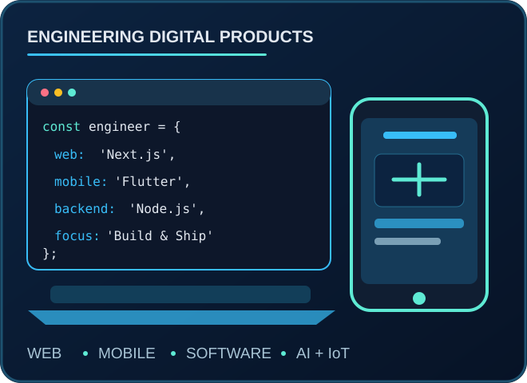

<!-- FARAN ALAM · PREMIUM GITHUB PROFILE README -->
<!-- Design system: midnight navy · electric cyan · silver · restrained teal -->
<div align="center">
<a href="https://faran-new-portfolio.vercel.app/">
  
</a>

<br />
<a href="https://faran-new-portfolio.vercel.app/"></a>
<a href="https://www.linkedin.com/in/faran-alam-14203abc"></a>
<a href="mailto:faranalam14203@gmail.com"></a>
<a href="https://github.com/FaranAlam"></a>


Computer Engineering · IIUI, Islamabad   |   Pakistan   |   Open to freelance projects & collaborations
</div>
---
01 / About Me
<table><tr><td width="65%" valign="top">
Engineering software from idea to deployment.
I'm Faran Alam, a Full Stack Software Engineer and Computer Engineering student at International Islamic University Islamabad. I design and develop web platforms, mobile applications and custom business software, with additional interests in intelligent hardware-connected systems.
Build: Next.js, React, Node.js, Express, MongoDB and PostgreSQL applications.
Engineer: authentication, role-based platforms, APIs, dashboards and digital workflows.
Explore: Flutter, computer vision, Edge AI, IoT and embedded systems.
Teach: web development and project-based learning through Faran Digital Academy.
> My focus: maintainable engineering, purposeful interfaces, and products that solve real problems.
</td><td width="35%" align="center" valign="middle">



</td></tr></table>
02 / Engineering Stack
<div align="center">
Discipline	Technologies & Tools
Frontend & Design	HTML5 · CSS3 · JavaScript · TypeScript · React · Next.js · Tailwind CSS · Bootstrap · Figma
Backend & APIs	Node.js · Express.js · Python · REST APIs · Authentication
Databases	MongoDB · PostgreSQL · MySQL · Data Modeling
Mobile	Flutter · Dart · Android Studio
AI & Computer Vision	TensorFlow Lite · OpenCV · CNN · Edge AI
IoT & Hardware	ESP32 · Arduino · Raspberry Pi · Sensor Integration
Workflow & Deployment	Git · GitHub · VS Code · Cursor · GitHub Copilot · Vercel · Postman · Linux


</div>
03 / Professional Experience
<table>
<tr><td width="100%">
Subcontractor Development Partner — Dream Growth Agency `Jul 2026 – Present`  
Custom websites, e-commerce mobile applications and production-oriented delivery for agency clients.
</td></tr>
<tr><td>
Full Stack Developer — Sarwar English Lab (xSEL) `Mar 2026 – Present`  
Next.js and MongoDB learning platform with role-based access, LMS workflows and an automated MCQ evaluation engine.
</td></tr>
<tr><td>
Founder, Instructor & Head of Department — Faran Digital Academy `Dec 2025 – Present`  
Technology education, web development instruction, student enrollment workflows and learner mentorship.
</td></tr>
<tr><td>
Volunteer Web Developer — ISCB-SC RSG Pakistan `Jan 2026 – Present`  
Organizational website development, workflow automation and bioinformatics-related web initiatives.
</td></tr>
<tr><td>
Freelance Software Engineer `Aug 2022 – Present`  
Custom websites, cross-platform applications, SEO and performance-focused client solutions.
</td></tr>
</table>
04 / Selected Projects
<table>
<tr>
<td width="50%" valign="top">
🎓 Faran Digital Academy
Education platform · Full stack
Student registration, enrollment and payment-integrated learning workflows.
`Next.js` `MongoDB` `Authentication`
Explore repository →
</td>
<td width="50%" valign="top">
💧 AquaFood
Food & water quality · Final-year design
Hybrid monitoring concept combining non-contact sensing, embedded hardware and AI-based analysis.
`IoT` `Sensors` `AI/ML` `Dashboard`
</td>
</tr>
<tr>
<td width="50%" valign="top">
🎓 xSEL Custom LMS
Learning management · Full stack
Role-based dashboards, assessments, authentication and administrative workflows.
`Next.js` `MongoDB` `Node.js`
</td>
<td width="50%" valign="top">
☀️ Solar Roof Estimator
Academic project · Edge AI
Estimation of solar electricity generation using hardware data and lightweight intelligent processing.
`TensorFlow Lite` `Flutter` `Embedded`
</td>
</tr>
<tr>
<td width="50%" valign="top">
🚗 Real-Time Lane Detection
Computer vision · Embedded AI
CNN and OpenCV-based lane detection targeting Raspberry Pi hardware.
`Python` `OpenCV` `CNN`
</td>
<td width="50%" valign="top">
📊 Mobile Shop POS & Inventory
Business software · Management system
Sales, stock tracking, inventory and administrative workflows.
`React` `Tailwind CSS` `Database`
</td>
</tr>
<tr>
<td colspan="2" align="center">
Also building: cross-platform Flutter applications, intelligent IoT systems and custom business software.
Explore all repositories →
</td>
</tr>
</table>
05 / Web, Mobile & Software Solutions
I build end-to-end products, from interface design and API development to databases, deployment and ongoing improvements.
Core development services
Web development: business websites, full-stack applications, e-learning platforms, dashboards and e-commerce experiences.
Mobile app development: cross-platform Flutter applications, API integrations and responsive mobile interfaces.
Custom software: management systems, POS and inventory solutions, role-based administration and workflow automation.
Engineering foundations: authentication, REST APIs, database modeling, performance and deployment.
Additional engineering interests
Edge AI, computer vision, IoT, embedded systems and sensor-integrated platforms.
Delivery at a glance
🌐 Full Stack Platforms	📱 Mobile Applications	🤖 Intelligent Systems	🔌 IoT & Hardware
Web apps & dashboards	Flutter & Dart	Edge AI & vision	ESP32 & Raspberry Pi
Authentication & APIs	API-driven experiences	TensorFlow Lite	Sensors & integration
Data-driven workflows	Cross-platform UI	On-device processing	Connected systems
06 / Credentials & Development Approach
NAVTTC — Full Stack Development · Grade A+ · Prime Minister's Youth Skills Development Program, Batch II  
BS Computer Engineering · International Islamic University Islamabad · 2022–2026  
Additional focus · SEO, Core Web Vitals, technical documentation and LaTeX engineering reports
```javascript
const approach = {
  philosophy: "Build → Learn → Improve → Ship",
  priorities: ["Maintainability", "Scalability", "User experience"],
  domains: ["Full stack", "Mobile", "Edge AI", "IoT"],
  currentFocus: ["E-learning platforms", "On-device ML", "Intelligent IoT"]
};
```
<details>
<summary><b>My development workspace & current areas of work</b></summary>
<br />
Tools: Cursor, VS Code, GitHub Copilot, Postman, Git and Vercel.
Hardware & testing: Raspberry Pi, ESP32 and Android mobile testing.
Current work: enterprise-style e-learning workflows, full-stack products, lightweight on-device ML and connected IoT systems.
Additional strengths: SEO, web performance and technical documentation.
</details>
07 / GitHub Insights
<div align="center">
<!-- External community widgets can occasionally be rate-limited or unavailable. -->


<br />

<sub>These widgets reflect public GitHub activity and may occasionally be unavailable due to third-party service limits.</sub>
</div>
<details>
<summary><b>Optional: contribution snake animation</b></summary>
<br />
To enable the animation, create `.github/workflows/snake.yml` in your profile repository (`FaranAlam/FaranAlam`) with the workflow below. Once it runs successfully, uncomment the image after this details block.
```yaml
name: Generate contribution snake
on:
  workflow_dispatch:
  schedule:
    - cron: "0 0 * * *"
permissions:
  contents: write
jobs:
  generate:
    runs-on: ubuntu-latest
    steps:
      - uses: Platane/snk@v3
        with:
          github_user_name: FaranAlam
          outputs: |
            dist/github-contribution-grid-snake.svg
            dist/github-contribution-grid-snake-dark.svg?palette=github-dark
      - uses: crazy-max/ghaction-github-pages@v4
        with:
          target_branch: output
          build_dir: dist
        env:
          GITHUB_TOKEN: ${{ secrets.GITHUB_TOKEN }}
```
</details>
<!-- Uncomment ONLY after the workflow creates the output branch:
<div align="center">

</div>
08 / Let's Connect
<div align="center">
Open to software engineering, full-stack development, freelance projects, collaborations, open source and mentorship.
<br />
<a href="https://faran-new-portfolio.vercel.app/"></a>
<a href="https://www.linkedin.com/in/faran-alam-14203abc"></a>
<a href="mailto:faranalam14203@gmail.com"></a>


Building scalable software. Connecting intelligent systems to the real world.

</div>
