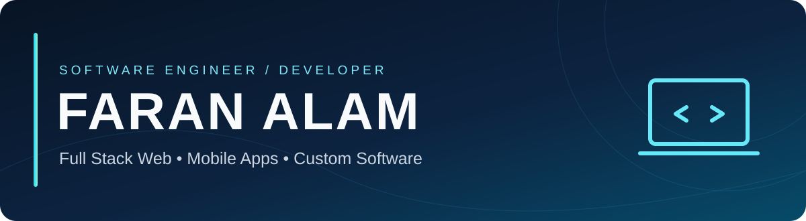

<!-- FARAN ALAM | SELF-HOSTED VISUALS | GITHUB-SAFE MARKDOWN -->

 

**Engineering complete digital products — from interface to infrastructure.**

[Portfolio](https://www.faranalam.com/) &nbsp; • &nbsp; [LinkedIn](https://www.linkedin.com/in/faran-alam-14203abc) &nbsp; • &nbsp; [GitHub](https://github.com/FaranAlam) &nbsp; • &nbsp; [Email](mailto:faranalam14203@gmail.com)

**Computer Engineering · IIUI, Islamabad · Pakistan**  
*Open to freelance projects and technical collaborations*

---

<table><tr><td width="65%" valign="top">
<h3>Engineering software from idea to deployment.</h3>

I'm <strong>Faran Alam</strong>, a Full Stack Software Engineer and Computer Engineering student at International Islamic University Islamabad. I develop web platforms, mobile applications and custom business software, with additional interests in intelligent hardware-connected systems.

<ul>
<li><strong>Web:</strong> Next.js, React, Node.js, Express, MongoDB and PostgreSQL.</li>
<li><strong>Mobile:</strong> Flutter, Dart and API-connected cross-platform apps.</li>
<li><strong>Software:</strong> Authentication, role-based platforms, dashboards, APIs and automation.</li>
<li><strong>Additional:</strong> Computer vision, Edge AI, IoT and embedded systems.</li>
<li><strong>Education:</strong> Web development and project-based learning through Faran Digital Academy.</li>
</ul>

<em>Maintainable engineering. Purposeful interfaces. Real-world solutions.</em>

</td><td width="35%" align="center" valign="middle"></td></tr></table>

| Discipline | Technologies and capabilities |
| :--- | :--- |
| **Frontend & UI** | HTML5, CSS3, JavaScript, TypeScript, React, Next.js, Tailwind CSS, Bootstrap, Figma |
| **Backend & APIs** | Node.js, Express.js, Python, REST APIs, authentication |
| **Databases** | MongoDB, PostgreSQL, MySQL, data modeling |
| **Mobile Engineering** | Flutter, Dart, Android Studio, API integration |
| **Intelligent Systems** | TensorFlow Lite, OpenCV, CNN, Edge AI |
| **Hardware & IoT** | ESP32, Arduino, Raspberry Pi, sensor integration |
| **Tooling & Delivery** | Git, GitHub, VS Code, Cursor, GitHub Copilot, Vercel, Postman, Linux |

| Role | Work |
| :--- | :--- |
| **Subcontractor Development Partner · Dream Growth Agency**   Jul 2026 – Present | Custom websites, e-commerce mobile applications and agency client delivery. |
| **Full Stack Developer · Sarwar English Lab (xSEL)**   Mar 2026 – Present | Next.js and MongoDB LMS, role-based access and automated MCQ evaluation. |
| **Founder, Instructor & Head of Department · [Faran Digital Academy](https://github.com/FaranAlam/faran-digital-academy)**   Dec 2025 – Present | Technology education, web courses, enrollment workflows and mentorship. |
| **Volunteer Web Developer · ISCB-SC RSG Pakistan**   Jan 2026 – Present | Website development, workflow automation and bioinformatics web initiatives. |
| **Freelance Software Engineer**   Aug 2022 – Present | Client websites, cross-platform apps, SEO and web performance. |

| Project | Scope & stack |
| :--- | :--- |
| **[Faran Digital Academy](https://github.com/FaranAlam/faran-digital-academy)** | Online education platform; registration, enrollment and payment-integrated workflows. `Next.js` `MongoDB` `Authentication` |
| **AquaFood** | Final-year hybrid non-contact food and water quality monitoring project using sensors and AI-based analysis. `IoT` `Sensors` `AI` |
| **xSEL Custom LMS** | Learning management platform with role-based dashboards, assessments and administrative workflows. `Next.js` `MongoDB` |
| **Solar Roof Estimator** | Academic Edge AI concept estimating solar electricity generation from hardware data. `TensorFlow Lite` `Flutter` |
| **Real-Time Lane Detection** | CNN and OpenCV lane-detection pipeline targeting Raspberry Pi. `Python` `OpenCV` |
| **Mobile Shop POS & Inventory** | Sales, stock tracking and administration system. `React` `Tailwind CSS` |

[**Explore my GitHub repositories →**](https://github.com/FaranAlam?tab=repositories)

| 🌐 Web platforms | 📱 Mobile apps | ⚙️ Custom software |
| :--- | :--- | :--- |
| Business websites | Flutter & Dart | POS & inventory |
| Full-stack applications | Cross-platform interfaces | Role-based dashboards |
| E-learning & e-commerce | API integrations | Workflow automation |
| Performance & deployment | Practical user experience | Databases & REST APIs |

**Additional engineering interests:** Edge AI, computer vision, IoT, embedded systems and sensor-integrated platforms.

- **NAVTTC — Full Stack Development:** Grade A+, Prime Minister's Youth Skills Development Program, Batch II.
- **BS Computer Engineering:** International Islamic University Islamabad, 2022–2026.
- **Additional experience:** SEO, Core Web Vitals, technical documentation and LaTeX engineering reports.

<strong>Development principles & workspace</strong>

**Approach:** Build → Learn → Improve → Ship  
**Priorities:** Maintainability · Scalability · User experience  
**Workspace:** Cursor · VS Code · GitHub Copilot · Postman · Git · Vercel  
**Hardware:** Raspberry Pi · ESP32 · Android mobile testing  
**Current focus:** E-learning platforms · Full-stack products · On-device ML · Connected IoT systems

## GitHub Activity

[**View live contributions, repositories and activity on GitHub →**](https://github.com/FaranAlam)

GitHub displays your live contribution calendar directly on your profile. This README intentionally avoids third-party analytics images that can show broken links or rate-limit errors.

**Software Engineering · Full Stack Web · Mobile Development · Custom Software**

[Portfolio](https://www.faranalam.com/) &nbsp; | &nbsp; [LinkedIn](https://www.linkedin.com/in/faran-alam-14203abc) &nbsp; | &nbsp; [Email](mailto:faranalam14203@gmail.com) &nbsp; | &nbsp; [Repositories](https://github.com/FaranAlam?tab=repositories)

*Let's build purposeful digital solutions.*

